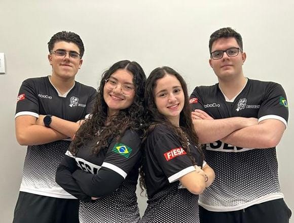

<h1>🤖 Repositório Robótica - RoboCup Soccer Lightweight</h1>

  Aqui você encontrará um breve resumo do conteúdo disponível e orientações de navegação, com o objetivo de facilitar sua experiência de pesquisa e exploração deste projeto. Esperamos que estas informações contribuam para uma compreensão mais clara do nosso trabalho em equipe e ajudem no aproveitamento máximo do material desenvolvido.

<h2>👥 Membros da Equipe</h2>

<table>
  <tr>
    <td width="250">
      
    </td>
    <td style="vertical-align: top; padding-left: 20px;">
      <ul>
        <li><strong>Enzo Losi</strong> – Software</li>
        <li><strong>Fernanda Gomes</strong> – Hardware</li>
        <li><strong>Vinícius Sabino</strong> – Hardware</li>
        <li><strong>Hyvinin Prado</strong> – Software</li>
      </ul>
    </td>
  </tr>
</table>

<h2>📁 Estrutura do Repositório</h2>

<pre>
├── <b>Design/</b>     → Estrutura física do robô e complementos de tal
├── <b>Extras/</b>     → Documentações, anotações e listas de peças
├── <b>Board/</b>      → Modelo e projeto em 3D da placa de circuito impresso
└── <b>Code/</b>       → Código-fonte principal do robô (Arduino/C++)
</pre>

<h2>🧾 Exemplo da Placa Eletrônica</h2>

  Abaixo, um exemplo visual da montagem da placa utilizada no robô:

<h2>⚙️ Tecnologias Utilizadas</h2>

<ul>
  <li>Arduino (Plataforma embarcada)</li>
  <li>Sensores ultrassônicos, infravermelho e bússola digital</li>
  <li>Linguagem C/C++ para lógica de movimentação e controle</li>
  <li>Git e GitHub para controle de versão e colaboração</li>
</ul>

<h2>📫 Contato</h2>

<ul>
  <li>📧 <strong>Email:</strong> biotechsoccer@gmail.com</li>
  <li>🌐 <strong>Instagram:</strong> <a href="https://www.instagram.com/sesibiotech">@sesibiotech</a></li>
</ul>

